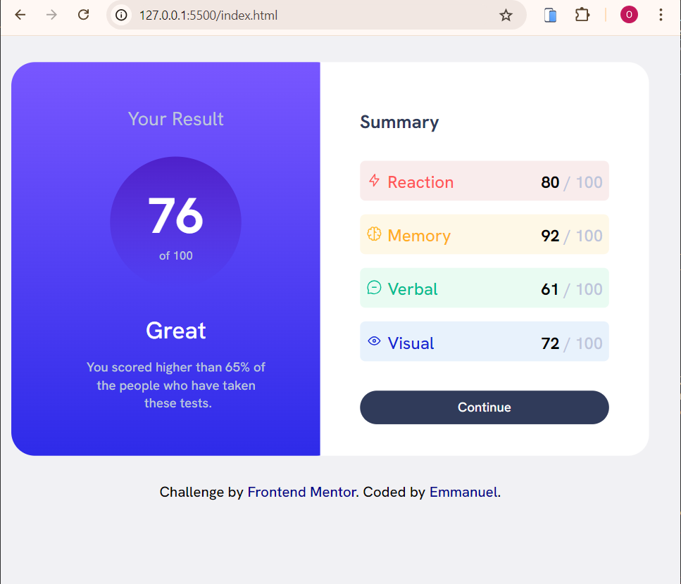
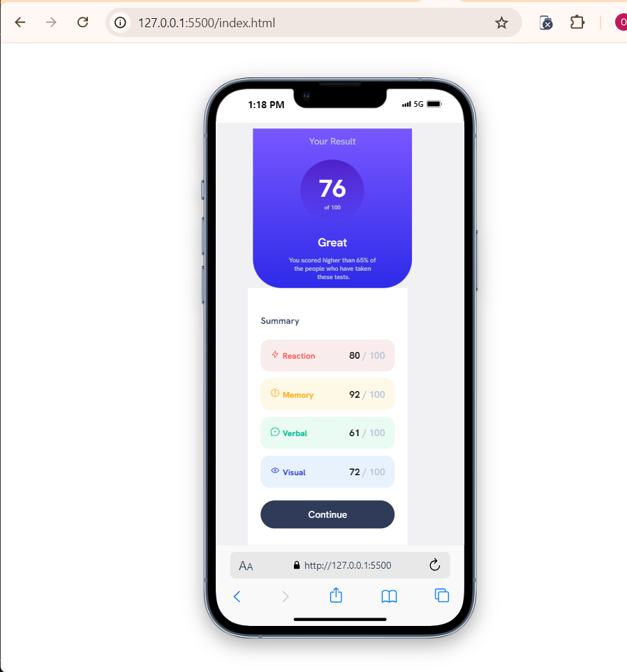
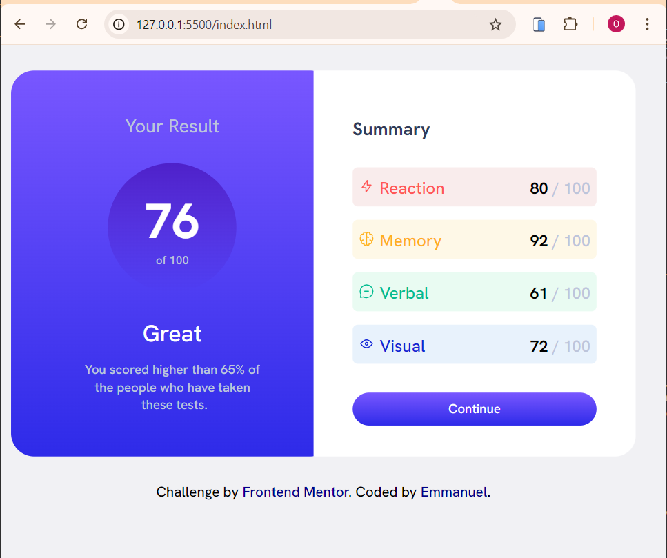

# Frontend Mentor - Results summary component solution

This is a solution to the [Results summary component challenge on Frontend Mentor](https://www.frontendmentor.io/challenges/results-summary-component-CE_K6s0maV). Frontend Mentor challenges help you improve your coding skills by building realistic projects.

## Table of contents

- [Overview](#overview)
  - [The challenge](#the-challenge)
  - [Screenshot](#screenshot)
  - [Links](#links)
  - [Built with](#built-with)
  - [Continued development](#continued-development)
- [Author](#author)
- [Acknowledgments](#acknowledgments)

## Overview

### The challenge

Users should be able to:

- View the optimal layout for the interface depending on their device's screen size
- See hover and focus states for all interactive elements on the page
- **Bonus**: Use the local JSON data to dynamically populate the content

### Screenshot

### Links

- Live Site URL: [Add live site URL here](https://results-summary-component-pearl-eight.vercel.app/)

### Built with

- Semantic HTML5 markup
- CSS custom properties
- Flexbox

### Continued development

I still want to continue practicing with html and css till i get to an advanced level and also improve my knowledge of flexbox.

## Author

- Frontend Mentor - [@notobd](https://www.frontendmentor.io/profile/notobd)

## Acknowledgments

Thanks to Favour for her input during my time working on this challenge.
